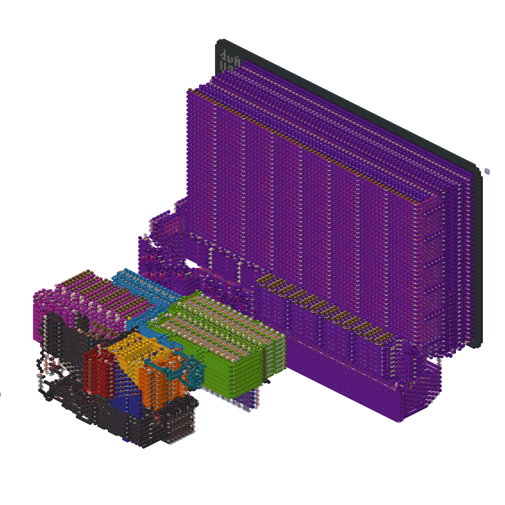
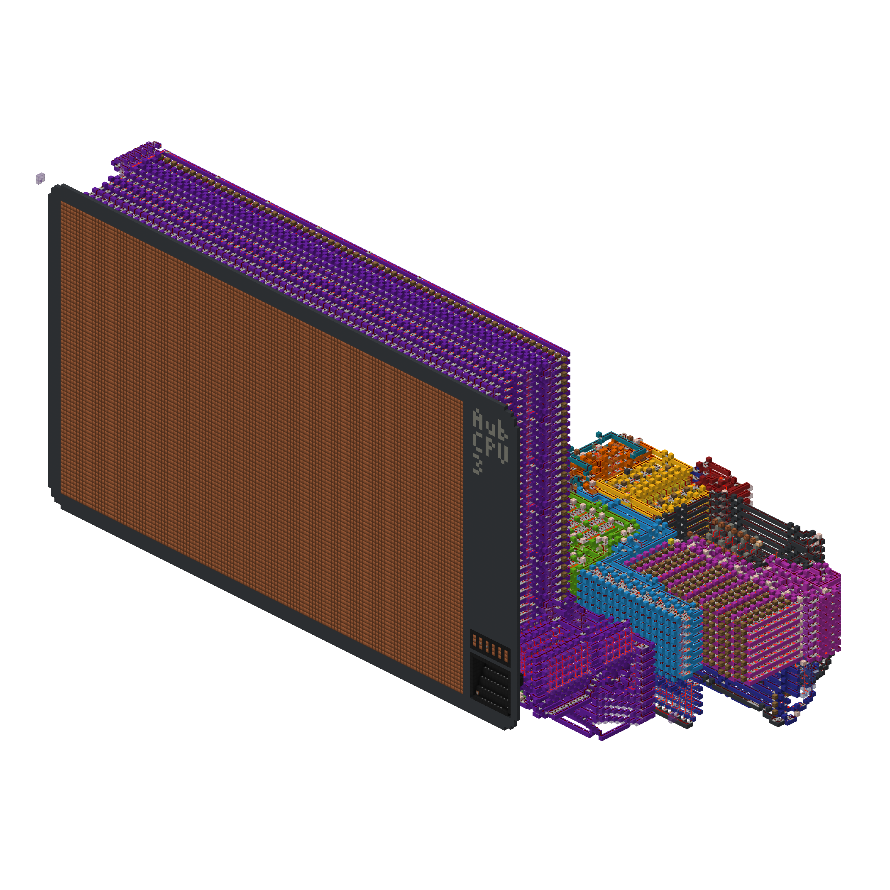

# AubCPU3

## Project Overview:
The CPU architecture started as a design for a Minecraft CPU, but after my first two Minecraft CPU projects failed, 
I was discouraged and shelved the idea. I later decided to revive the project and to implement it as an emulator instead. 
I discovered that it is much easier to write an ISA emulator than it is to build a CPU in Minecraft, and so I made quick 
progress. Partway through writing the emulator I realized I needed to start on the assmebler. Luckily I could borrow code 
from an earlier project, and I got a barebones assembler working in under a day. Once I had finished the emulator and the 
assembler I had the confidence to attempt it in Minecraft.

The Minecraft CPU is nearly finished now. It can run all instructions, but I need to make a few finishing touches, and 
finish the I/O devices.

## ISA:
[Here is a link to the ISA](https://docs.google.com/spreadsheets/d/11cn81OlmGuavFOMhcwz3XO1XdnuuvSuiQp1ry-v5G9E/edit?usp=sharing)

### General architecture:
- Harvard architecture (instructions are stored in a separate memory space from data)
- Load-store architecture
- 16 registers (x0 thrpugh x15)
    - x0 is hardwired to zero
    - x1 is the return value register
    - x2 through x4 are argument registers for calling subroutines
    - x5 though x12 are general purpose
    - x13 is the flag register
    - x14 is the stack pointer
    - x15 is the program counter
- All registers can be used as pointers into main memory
- 8-bit data, 8-bit addresses
- 16-bit instruction word, 256 instructions in program memory
    - 4-bit opcode
    - 2 operand architecture
- 240 bytes of main memory (data)
- 16 memory-mapped I/O ports (8 input, 8 output)

### Some sneaky tricks:
When I was designing the ISA I was debating between a 5-bit or a 4-bit opcode (32 or 16 instructions, respectively), 
but I figured out some sneaky ways of getting away with a 4-bit opcode without losing any of the functionality I wanted.

By making the program counter an addressable register, it means I can use it as an operand in a "load immediate"
operation, which means I don't need an unconditional jump instruction. 

The flag register is also addressable, and therefore a valid operand. This fact means I only need
one conditional jump instruction (jump if not zero) yet I'm still able to jump on any condition.
Imagine you were doing addition and wanted to jump on an overflow, here's how that would work:
   1. do the addition
   2. do a load immediate with a bit mask that contains a "1" at the position of the overflow flag
   3. do a bitwise AND between this bitmask and the flag register, this will update the flag register with the flags 
from the AND operation. Which means that if the operation returned a non-zero value (the overflow flag *was* set), 
then the not-zero flag would now be set at the end of the clock cycle.
   4. do the jump if not zero

Another small trick is the omission of a bitwise NOT operation. I decided not to include one because you can accomplish
a bitwise NOT of a value if you instead XOR it with the value 0xFF (for 8-bit data). So what would have been one instruction
(a bitwise NOT) is now two (a load immediate of 0xFF, and an XOR).

### Caller-Callee agreement:
- The first three arguments of a subroutine will be stored in x2 through x4
- Any additional arguments will be pushed onto the stack
- The return value will be stored in x1
- The return address will be the last thing pushed onto the stack
- The return address will be deallocated by the caller
- x1 through x4 are caller-saved
- x5 through x12 are callee-saved

### I/O:
In the AubCPU3, I/O is memory-mapped to the lower 16 addresses of main memory. However, each address is only used for 
either output or input, but not both.

In the emulator, I wrote a class called "FancyConsole" (a development from a previous class I had named Console) which
served as an I/O device that interfaced with the standard console as a simple way to output values.

In the Minecraft computer, I am building an in-game display that mimics the behavior of the standard console in order
to keep the interface the same.

## Minecraft:

Building a CPU in Minecraft is roughly equivalent to building a CPU from the transistor level up, or at least from the
logic gate up. There are no "out of the box" mass-memory components or anything like that, it all has to be built from
logic gates.

**Here are some renders of the AubCPU3 in Minecraft as of 2024/08/26:**

**Legend:**
- Lime green - Main memory
- Pinkish/Magenta - Program memory
- Yellow - Registers
- Red - Program counter
- Orange - ALU
- Dark gray - Control logic
- Light blue - Data bus
- Dark blue - Address bus
- Purple - I/O display

